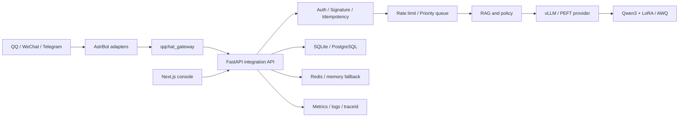

# QQChat Enhanced 保研项目答辩与深度问答手册

> 目标：帮助项目作者准确讲清研究问题、技术选择、工程实现、实验边界与个人贡献，并能应对老师从 LLM 原理、实验设计、系统架构、可靠性、安全和研究诚信等方向的追问。
>
> 使用原则：只陈述仓库和实验记录能够证明的事实。将“已实现”“已验证”“待实验”严格分开；负结果和局限性同样属于研究能力的证据。

## 1. 项目的一句话定位

QQChat Enhanced 不是简单的聊天机器人，而是一个围绕角色语言模型构建的、可训练、可检索、可评测、可部署和可审计的单机研究原型。

它试图回答三个递进问题：

1. 如何让开源 LLM 学会一个角色，而不是只靠很长的 Prompt 模仿？
2. 如何证明一种训练或检索方法真的有效，而不是“感觉回答更像了”？
3. 如何把实验模型稳定接入 QQ、微信和 Telegram 等真实消息平台，同时保证并发、幂等、安全和可观测？

完整证据链是：

`原始语料 -> 数据治理 -> SFT/PEFT -> Gold 评测 -> RAG -> AWQ/vLLM -> AstrBot -> 在线反馈`

## 2. 最应该讲好的故事

### 2.1 第一阶段：从“能回答”到“像角色”

最初目标是让通用模型进行角色对话。仅使用系统提示词时，模型能回答，但人物语气、事实关系和情绪边界不稳定。因此项目从原作中提取可审计台词，构造训练集和验证集，并通过 LoRA 进行监督微调。

这里体现的能力不是“会调用训练脚本”，而是理解模型行为由数据分布、训练目标、Prompt 和解码参数共同决定。

### 2.2 第二阶段：从“像角色”到“可以证明”

早期实验暴露出三个问题：生成数据会模板化，评测题可能泄漏进训练集，单次主观比较容易受位置和偏好影响。项目因此建立人物画像、canonical 数据、固定 validation、Gold v2、哈希与盲评流程，并保留失败实验。

最关键的认知升级是：模型优化不是不断叠加技巧，而是控制变量。R1-E1 到 R1-E5 每次只改变 LoRA、NEFTune、DoRA、RSLoRA 或 Sequence Packing 中的一个因素。

### 2.3 第三阶段：从“实验模型”到“真实系统”

一个模型离实际可用还差推理、检索、并发和平台连接。项目使用 vLLM 提供 OpenAI 兼容推理，使用 AWQ 降低显存，用 RAG 提供外部知识和证据，通过 AstrBot 把 QQ、微信系和 Telegram 事件标准化后交给 FastAPI。

系统层又加入幂等、限流、优先级队列、同会话串行、超时、熔断、降级、结构化日志和 traceId。这体现了把 LLM 当成不稳定且昂贵的外部能力来治理，而不是把一次模型调用等同于完整产品。

## 3. 三种时长的口述版本

### 3.1 30 秒版本

“我的项目是一个面向角色对话研究的多平台 LLM 系统。我以月社妃作为主要研究角色，从原作语料治理开始，使用 Qwen3-8B 做 LoRA 系列受控实验，并建立了固定验证集、Gold Set、泄漏审计和人工盲评。推理侧使用 AWQ 和 vLLM，知识侧比较向量、BM25、Hybrid 与 Reranker，最后通过 AstrBot 接入 QQ、微信和 Telegram。我的重点不是堆功能，而是把数据、训练、推理、评测和工程部署连成一条可复现证据链。”

### 3.2 2 分钟版本

“这个项目最初来自一个很具体的问题：通用大模型即使知道角色设定，也很难长期保持人物语言、关系事实和情绪边界。我没有停留在 Prompt 工程，而是从原作中提取台词，建立人物画像、训练集、固定验证集和未参与训练的 Gold Set，再用 Qwen3-8B 做参数高效微调。

训练上我把标准 LoRA 作为基线，分别比较 NEFTune、DoRA、RSLoRA 和 Sequence Packing，并固定数据、随机种子、rank、alpha、target modules 与生成参数。这样实验失败也有意义，因为我能解释质量、显存、训练速度和稳定性之间的权衡。

项目还把参数知识和外部知识分开：角色风格由 LoRA 学习，动态事实由 RAG 检索。RAG 不是只做向量搜索，而是比较 BM25、向量、Hybrid 和 Reranker，并评估 Recall@K、MRR、引用忠实度和拒答。

工程上，模型通过 vLLM 提供服务，AWQ 用于显存友好的推理，FastAPI 负责会话、队列、历史和观测，AstrBot 负责多平台消息连接。系统实现了签名防重放、消息幂等、分级限流、同会话串行、超时、熔断和 traceId。这个项目让我完整经历了数据、训练、推理、评测和部署，而不只是调用 API。”

### 3.3 8 分钟展示结构

1. 研究问题，45 秒：为什么角色一致性不能只靠 Prompt。
2. 数据治理，75 秒：1,598 条原作台词、V4 人工审核、冻结契约与防泄漏设计。
3. PEFT，90 秒：LoRA 基线与 E1-E5 单变量实验。
4. RAG，60 秒：参数记忆与外部知识分工、检索和回答分层。
5. 推理，60 秒：BF16、AWQ、动态 LoRA、Merge、真实 TTFT。
6. 系统，75 秒：AstrBot -> FastAPI -> 队列/RAG -> vLLM -> 数据库。
7. 结果与诚信，45 秒：prompt-v1 pilot 无显著差异，不能夸大为提升。
8. 下一步，30 秒：完成 V4 数据审核、R1V4、冻结 R2、运行 R3、审核 DPO 偏好对。

## 4. 当前事实与结论边界

### 4.1 已经完成并有仓库证据

- 官方 `Qwen/Qwen3-8B` 训练与 `Qwen/Qwen3-8B-AWQ` 推理基线；项目中的 `-Instruct` 仅是本地兼容目录别名。
- 月社妃人物画像依据 1,598 条原作直接台词。
- 旧 canonical train 826 条、validation 92 条和 Gold v2 均保留为可追溯历史；Gold v2 现只作开发集。
- V4 人物画像已确认，prompt v3 与训练/验证候选正在人工审核；正式训练被门禁阻塞。
- R1-E1 标准 LoRA、R1-E2 LoRA + NEFTune 的 Seed 42 adapter 已完成。
- prompt-v1 pilot 盲评结果：E1 胜 26、E2 胜 32、平局 62，双侧精确符号检验 p=0.512。
- R1V4 已预注册 E1 LoRA、E2 NEFTune、E3 DoRA、E4 RSLoRA、E5 Packing 的单变量设计；配置在数据冻结后生成。
- R2 的 60 条 held-out RAG 候选集已生成。
- R3 的真实 SSE TTFT 基准器已经实现。
- FastAPI、Next.js、SQLite/PostgreSQL、Redis 退化路径、vLLM、AstrBot 网关等工程链路已实现。
- AstrBot 内部接口支持 token 轮换、时间戳、nonce 和 HMAC 签名。
- 消息链实现限流、优先级、队列容量、同会话串行、幂等和 traceId。

### 4.2 目前不能声称的结论

- 不能说 NEFTune 已显著优于 LoRA。当前 p=0.512，没有显著证据。
- 不能说 DoRA、RSLoRA 或 Packing 已经更优，它们仍待正式训练和统一评测。
- 不能说 RAG 的 Hybrid + Reranker 已经最好，R2 数据还需要人工冻结。
- 不能说 AWQ 一定比 BF16 整体更快；它通常节省显存，但吞吐和延迟需要在具体硬件与并发下测量。
- 不能说完成了 RLHF。项目规划的是 DPO pilot，并且仍被人工偏好数据门禁阻塞。
- 不能声称多角色泛化。Minamo 和胡桃只用于部署与路由演示。
- 不能把 mock、旧 Qwen2.5 报告或历史 E2/E2'/E2'' 混入当前正式结论。

## 5. 架构讲解

### 5.1 为什么 AstrBot 只做网关

平台适配变化快，LLM/RAG/数据逻辑变化也快。把两者分开可以避免每增加一个平台就复制模型逻辑。AstrBot 只负责事件标准化、后端调用和发送结果，FastAPI 才是核心业务边界。

这是关注点分离和依赖倒置的体现：平台事件依赖统一消息协议，而不是核心服务依赖 QQ、Telegram 或微信的具体事件类。

### 5.2 一条消息的完整调用链

1. 平台适配器收到原始事件。
2. 插件提取 platform、adapter、messageId、conversationId、senderId 和 text。
3. 插件生成时间戳、nonce 和签名，调用内部接口。
4. 后端完成鉴权、防重放、输入校验和幂等检查。
5. 读取平台与会话开关，应用 conversation/sender/global 限流。
6. 任务按来源和会话类型进入优先级队列。
7. 同一会话通过锁串行执行，避免上下文乱序。
8. 根据策略执行 RAG、选择 LoRA 和调用 vLLM。
9. 推理失败时根据群聊/私聊执行静默或简短降级。
10. 保存消息、模型调用和 integration event，并返回同一个 traceId。
11. AstrBot 发送一次回复，并在插件日志记录 traceId。

### 5.3 为什么生产推荐 PostgreSQL，SQLite 仍然保留

SQLite 部署简单，适合本地单进程演示；但并发写入、连接管理和水平扩展受限。PostgreSQL 提供更稳定的事务、并发、约束和索引能力。项目保留两个实现是为了降低本地使用门槛，同时通过统一 DTO 和迁移脚本控制差异。

## 6. LLM 技术必须会回答的问题

### 6.1 LoRA 是什么

对线性层权重 W 不直接全量更新，而是学习低秩增量：

`W' = W + (alpha / r) * B * A`

其中 A 和 B 的秩为 r。训练参数量从与原矩阵规模相关，降为与输入维度、输出维度和 r 的乘积相关。基座权重保持冻结，adapter 易于保存、切换和组合。

老师追问：r 越大越好吗？

回答：不是。更大的 r 提高表达容量，也增加显存、训练时间和过拟合风险。应该固定其他变量，通过验证集、角色盲评和训练成本共同选择，而不是只看训练 loss。

老师追问：alpha 做什么？

回答：alpha 控制低秩更新的缩放。标准 LoRA 常用 alpha/r；如果 r 改变但缩放不合理，实验实际改变的不只是容量，也改变了更新幅度，因此 r 与 alpha 的实验必须明确缩放规则。

### 6.2 为什么选择七个 target modules

Qwen 类 Transformer 中，注意力投影和 MLP 投影共同影响语言风格与知识表达。项目固定 target modules，避免不同实验因注入位置变化而失去可比性。回答时应给出实际配置文件，不凭记忆随口列模块。

### 6.3 DoRA 与 LoRA 的区别

DoRA 将权重更新理解为方向和幅值两部分。LoRA 主要低秩更新方向，DoRA额外学习 magnitude，希望在相近参数预算下更接近全量微调的表达能力。代价是实现和部署兼容性更复杂，所以项目把它作为独立单变量 E3，而不与 NEFTune 或 RSLoRA 叠加。

### 6.4 RSLoRA 是什么

RSLoRA 调整 rank 增大时的缩放，常见形式由 alpha/r 改为 alpha/sqrt(r)，目标是让不同 rank 下的更新尺度更稳定。它不是另一套数据，也不是与 DoRA 必须同时开启的方法，因此项目将其作为独立 E4。

### 6.5 NEFTune 是什么

NEFTune 在训练时向 embedding 表示加入受控噪声，属于正则化方法。它不改变推理结构，目标是降低对有限指令样本的机械记忆、改善泛化。是否有效必须通过相同 adapter 结构和相同数据对比，不能从 loss 单独推断。

### 6.6 Sequence Packing 是什么

Packing 将多个短样本组合进固定长度序列，减少 padding 浪费，提高有效 tokens/s。关键不是简单拼接文本，而是正确构造 attention、边界和 label mask，避免一个样本的目标泄漏到另一个样本。E5主要研究效率，也要检查质量是否变化。

### 6.7 QLoRA 与 AWQ 的区别

- QLoRA 是训练方案：以低比特基座参与前向/反向，在其上训练 LoRA，重点是降低微调显存。
- AWQ 是推理量化：利用激活统计保护重要权重通道，重点是部署时降低权重显存。
- AWQ/GPTQ 推理模型通常不应直接作为本项目正式 SFT 基座。

### 6.8 为什么使用 AWQ

RTX 3090 只有 24GB 显存。8B BF16 权重本身约占 16GB，推理还需要 KV Cache、运行时缓冲和 LoRA。AWQ 4-bit 能显著降低权重占用，把更多显存留给上下文和并发。但质量、TTFT、吞吐都必须实测，不能只报告显存。

### 6.9 vLLM 为什么快

核心思想包括连续批处理和高效 KV Cache 管理。请求到达时间和长度不同，静态 batch 会产生空闲；continuous batching 可以动态加入和移出请求。PagedAttention 类设计把 KV Cache 分页管理，降低碎片并提高并发容量。

老师追问：为什么不用 Transformers generate？

回答：Transformers 适合训练、调试和小规模离线生成；vLLM 更适合长期服务、多请求并发、流式输出和 OpenAI 兼容接口。项目同时保留 provider 抽象，是为了训练与部署职责分离。

## 7. RAG 技术必须会回答的问题

### 7.1 为什么 LoRA 之后还需要 RAG

LoRA 更适合学习稳定的角色风格、表达偏好和任务行为；动态知识、长尾事实和可追溯证据更适合放在外部知识库。把所有知识写进 adapter 会带来更新成本、遗忘和证据不可追踪问题。

### 7.2 Vector、BM25、Hybrid 的区别

- Vector：根据语义向量相似度检索，适合同义表达，但可能忽略精确实体词。
- BM25：基于词项频率和逆文档频率，精确关键词效果好，但同义改写较弱。
- Hybrid：合并两种排序，覆盖语义和关键词。
- Reranker：对候选 query-document 对进行更精细的相关性判断，通常更准但增加延迟。

### 7.3 为什么检索评测和回答评测要分层

如果最终回答错误，原因可能是没检索到证据，也可能是模型拿到证据后推理错误。只看最终回答无法定位瓶颈。因此 R2 先比较 Recall@K、MRR、nDCG，再固定最佳检索器比较直接回答、置信度拒答和 Corrective RAG。

### 7.4 指标如何解释

- Recall@K：正确证据是否出现在前 K 个结果中。
- MRR：第一个正确证据越靠前，分数越高。
- nDCG@K：考虑多个证据的相关性等级和排序位置。
- 引用命中率：回答引用的来源是否包含目标证据。
- 证据忠实度：回答中的关键陈述是否能由引用内容支持。
- 拒答准确率：无答案问题是否正确拒答。
- 过度拒答率：有答案问题被错误拒绝的比例。

### 7.5 Corrective RAG 是什么

先检索并评估证据质量；证据不足时允许对 query 重写并最多重试一次，仍不足则拒答。限制重试次数是为了控制尾延迟和成本，避免检索循环。

## 8. 评测与实验设计

### 8.1 为什么训练集、validation 和 Gold Set 必须分开

训练集用于优化参数；validation 用于训练过程中的模型选择和过拟合观察；Gold Set 用于最终泛化评估。如果 Gold 问题进入训练集，最终指标测到的是记忆而不是泛化。

### 8.2 如何防数据泄漏

- 精确归一化匹配阻止直接重复。
- 文本近似相似度阻止改写重复。
- 语义相似度高的样本进入人工复核。
- 先冻结训练数据，再冻结 Gold。
- 保存排除报告、数据数量和 SHA256。

### 8.3 为什么需要哈希和 Git commit

只记录“使用了某个 JSON”不够，因为文件可能被修改。数据、Prompt、配置和 adapter 哈希与 Git commit 共同形成实验 provenance，使结果可以追溯到准确输入和代码状态。

### 8.4 为什么自动指标不能替代人工盲评

困惑度、重复率和 Distinct-N 能发现流畅度或模式坍缩，但无法完整判断人物动机、关系距离和含蓄情绪。LLM-as-a-Judge 也有位置、长度、自我偏好等偏差。项目采用自动指标做诊断，人物质量结论依赖隐藏模型身份的人工盲评。

### 8.5 如何理解当前 p=0.512

在去除平局后，用双侧精确符号检验判断 E1/E2 胜负是否偏离 50%。p=0.512 表明当前样本不足以拒绝“二者胜率相同”的原假设。正确说法是“没有观察到显著差异”，不是“证明两者完全相同”，也不是“E2 更好”。

### 8.6 为什么只先做 Seed 42

先用一个 seed 打通数据、训练、评测和盲评全链路，能更早发现系统性错误，节省共享 GPU。完整流程稳定后，只对基线和最佳候选补 Seed 43/44，报告均值和标准差。单种子结果必须称为 pilot。

## 9. DPO 必须会回答的问题

DPO 使用 chosen/rejected 偏好对，直接提高模型对 chosen 相对 rejected 的偏好，同时通过参考模型约束分布偏移。它不需要在线训练奖励模型和 PPO，因此比完整 RLHF 流程简单。

项目为什么暂时不运行？因为偏好对必须先人工批准，至少 100 条后才允许按 80/20 冻结训练和 held-out。未经审核的 AI 偏好不能作为正式对齐证据。

为什么称 pilot？数据规模小、角色单一、只运行一个 QLoRA DPO 配置，无法支持“完成 RLHF”或广泛对齐能力的结论。

## 10. 高并发与可靠性问答

### 10.1 为什么模型调用不能无限并发

GPU 显存、KV Cache 和调度能力有限。无限并发会引发 OOM、超时放大和队列雪崩。因此项目在入口限流后进入有界优先级队列，再由最大推理并发控制实际模型调用。

### 10.2 为什么同一会话要串行

同一会话的第二条消息可能依赖第一条回复。如果并行推理，后完成的旧请求可能覆盖新上下文，造成顺序错乱。不同会话可以并行，同一会话通过锁串行。

### 10.3 队列为什么有优先级

管理台测试最高、私聊较高、群聊较低。这样群聊刷屏时不会完全阻塞人工测试和私聊。队列满时必须拒绝或降级，而不是继续积压。

### 10.4 幂等怎么做

有 messageId 时使用 platform + adapter + messageId；没有稳定 messageId 时使用平台、会话、发送者、时间桶和文本哈希构造稳定键。数据库唯一约束与缓存共同避免重复推理和重复发送。

### 10.5 超时、重试和幂等是什么关系

客户端超时不代表服务端没有执行。如果盲目重试，可能产生两次模型调用或两次发送。因此重试必须携带相同幂等键；模型推理是否重试还要考虑成本和队列压力。

### 10.6 熔断与降级

vLLM 连续失败后熔断，避免每条请求都等待完整超时；RAG 异常时可以跳过检索；群聊默认静默，私聊返回简短提示；数据库写入失败要记录，但不能再次推理。

## 11. 安全问题

### 11.1 AstrBot 内部接口为什么不能只靠 URL 隐藏

内网地址也可能泄漏或被横向访问。项目使用 integration token，并支持 token 轮换；增强模式使用 timestamp、nonce 和 HMAC signature，后端校验时间窗口和 nonce，防止重放。

### 11.2 CSRF 与 JWT 分别解决什么

JWT/会话认证回答“你是谁”；CSRF 防护回答“这个浏览器发出的状态修改请求是否来自允许的站点”。Cookie 使用 HttpOnly/SameSite，代理层检查 Origin/Referer 或 CSRF token，防止攻击页面借用用户登录态修改配置。

### 11.3 Prompt injection 如何处理

- 系统指令、RAG 证据和用户文本分层组装。
- 用户不能覆盖 system prompt。
- 管理命令走独立鉴权，不允许普通聊天触发。
- 对读取密钥、导出配置、执行危险工具等意图执行策略拦截。
- RAG 文档被视为不可信数据，不自动成为系统指令。

### 11.4 为什么不自动下载 IM 中的文件

外部 URL 可能包含恶意文件、内网探测地址或超大内容。第一阶段只保存媒体元信息，下载和解析必须经过类型、大小、域名、超时和隔离策略。

## 12. 可观测性

每条消息生成 traceId，并贯穿插件、后端、RAG、模型调用和历史记录。结构化日志至少包含 platform、conversationId、senderId、model、costTime 和 errorType。

关键指标：消息率、回复率、错误率、P50/P95/P99、队列长度、当前推理并发、模型失败率、RAG 失败率和平台状态。

老师追问：日志和指标有什么区别？

回答：日志适合解释单次事件，指标适合发现趋势和告警，trace 用于跨组件还原一条请求。三者不能互相替代。

## 13. 最可能被老师追问的 30 个问题

1. 为什么不用 Prompt 就够了？答：Prompt 适合快速约束，LoRA 用于稳定学习分布；项目通过统一 Gold 比较两者，而不是预设 LoRA 必胜。
2. 为什么选 Qwen3-8B？答：中文能力、开放生态、8B 在 3090 上可训练部署，以及与 vLLM/PEFT 的工程兼容性。
3. 为什么不用更大模型？答：共享算力和可重复实验约束；研究价值来自控制变量和完整证据，不来自参数规模。
4. 为什么 r=32？答：作为固定中等容量基线；项目当前重点比较方法，不同时扫描 rank，避免多重变量。
5. loss 下降就说明角色更像吗？答：不说明，loss 衡量 token 预测，角色一致性需 Gold 和盲评。
6. 如何判断过拟合？答：train/eval loss 分离、重复率、未见 Gold、事实错误和生成多样性。
7. 为什么 Gold 有 RAG 类？答：验证系统能否基于外部证据回答与拒答，但 RAG 指标不混入 LoRA 风格门禁。
8. LLM 生成的数据可靠吗？答：不能直接信任，需要原作 few-shot、配额、Judge、重复检查和人工抽检。
9. LLM-as-Judge 有什么偏差？答：位置、长度、措辞、自我偏好和参考答案偏差。
10. 为什么保留负结果？答：避免选择性报告，也帮助解释方法适用边界。
11. DoRA 和 RSLoRA 能同时开吗？答：技术上某些实现可组合，但受控实验中不同时开，否则无法归因。
12. NEFTune 推理时有额外开销吗？答：通常没有，它是训练阶段 embedding 噪声。
13. Packing 会污染样本吗？答：错误的边界和 label mask 会，所以必须有契约测试。
14. AWQ 是否影响质量？答：可能，必须和 BF16 在同一 prompt 上做质量差与性能对照。
15. AWQ 能否直接训练？答：正式 SFT 不使用 AWQ 推理权重作为基座。
16. vLLM 如何加载 LoRA？答：服务启用 LoRA，按 served adapter 名动态选择；加载前做基座兼容性检查。
17. 动态 LoRA 和 Merge 如何取舍？答：动态适合多角色、切换快；Merge 适合固定角色和隔离基准，但生成独立模型制品。
18. 为什么 RAG 不直接把文档 ID 写进人物回复？答：会破坏角色自然度；引用通过结构化字段由前端展示。
19. 如何处理无答案问题？答：置信度和证据门槛，不足则拒答；测拒答准确率和过度拒答率。
20. 为什么用 BGE-M3？答：支持中文和多语言语义检索，适合本项目语料；是否最优仍需对照实验。
21. Redis 挂了怎么办？答：小规模功能可退化到有界内存实现，生产多实例下则标记 degraded，不能声称跨进程一致。
22. 数据库写入失败怎么办？答：返回降级并记录 trace；不能重复推理来“补写”。
23. 如何防止群聊刷屏？答：群聊触发策略、conversation/sender/global 限流、低优先级和有界队列。
24. 为什么不用微服务？答：个人研究项目优先模块化单体，边界清晰但部署简单；模型和 AstrBot 已独立进程化。
25. 为什么不用 Kubernetes？答：它不能直接提高研究结论，且增加展示和运维噪声，不符合当前规模。
26. 如何复现实验？答：Git commit、环境、命令、seed、数据/config/prompt/model/adapter 哈希和原始结果。
27. 你的个人贡献是什么？答：数据治理、实验设计、训练与评测脚本、后端调用链、多平台协议、可靠性和部署整合；必须按自己实际完成范围回答。
28. 最大失败是什么？答：早期生成数据模板化和评测污染风险，促成 canonical 数据、Gold 冻结与逐条审核体系。
29. 项目最大的局限是什么？答：单角色、单 seed 主线尚未完全结束、人工评测规模有限、真实平台稳定性受第三方适配影响。
30. 下一步最重要是什么？答：先完成 R1 全链路，再冻结 R2 和执行 R3；不同时展开过多实验。

## 14. 现场演示脚本

### 14.1 正常路径，5 分钟

1. 打开监控页，展示后端、vLLM、队列和平台状态。
2. 在角色聊天页选择月社妃 LoRA，发送一条日常问题和一条人物关系问题。
3. 打开历史记录，展示 platform、conversation、model、LoRA、costTime 和 traceId。
4. 提交一个 RAG 问题，展示正文与独立 citation、confidence、abstained 字段。
5. 打开实验页，展示 E1-E5 固定配置、哈希和状态，而不是只展示一张漂亮结果图。
6. 打开 AstrBot 平台页，展示统一协议与连接边界。

### 14.2 必须准备的降级演示

- vLLM 未启动：展示 ready/degraded 和明确错误，不伪造回复。
- 重复 messageId：第二次不重复推理和发送。
- 超长输入或错误签名：返回 400/401。
- RAG 无证据：展示拒答而不是编造。
- 队列满：展示 shouldReply=false 或私聊降级提示。

### 14.3 演示前检查

- 固定演示 commit，不在现场临时 pull。
- 保存 3 组已验证 prompt，但不要只演示最好样本。
- 提前预热模型，记录首次启动时间和稳态延迟的区别。
- 准备录屏和静态结果作为网络或平台故障后备。
- 隐藏密钥、账号、个人微信标识和服务器密码。

## 15. 简历与材料表述

### 15.1 简历三行版

- 构建 Qwen3-8B 角色对话研究系统，完成原作语料治理、LoRA/NEFTune/DoRA/RSLoRA/Packing 受控实验设计及 Gold Set、泄漏审计和人工盲评流程。
- 基于 BGE-M3、BM25、FAISS 与 Reranker 实现分层 RAG，设计 Recall@K、MRR、nDCG、引用忠实度和拒答评测。
- 使用 FastAPI、vLLM、AWQ、PostgreSQL/SQLite、Redis 与 AstrBot 搭建多平台推理链路，实现幂等、限流、优先级队列、会话串行、签名防重放和 traceId 观测。

### 15.2 不建议的表述

- “精通 RLHF”：当前只有 DPO pilot 计划。
- “显著提升模型效果”：prompt-v1 E1/E2 没有显著差异。
- “支持所有微信”：不同微信适配方式稳定性和合规性不同。
- “高并发生产系统”：应说实现了并发治理并完成有限压力测试，除非已有正式容量数据。
- “跨角色泛化”：当前没有足够实验支持。

## 16. 你的能力映射

| 能力 | 项目证据 |
| --- | --- |
| LLM 数据 | 原作提取、人物画像、canonical、Gold、泄漏审计、数据哈希 |
| 参数高效微调 | LoRA、NEFTune、DoRA、RSLoRA、Packing、DPO 门禁 |
| 推理优化 | AWQ、vLLM、动态 LoRA、Merge、SSE TTFT |
| 检索增强 | BGE-M3、BM25、Hybrid、Reranker、Corrective RAG |
| 实验方法 | 单变量、固定 seed、盲评、显著性、负结果保留、provenance |
| 后端工程 | FastAPI、统一 DTO、SQLite/PG 迁移、队列、缓存、熔断 |
| 安全 | JWT、CSRF、token 轮换、HMAC、防重放、输入限制和脱敏 |
| 可观测性 | traceId、结构化日志、延迟/错误/队列指标和健康检查 |
| 系统集成 | AstrBot 统一 QQ、微信系、Telegram 消息协议 |
| 工程判断 | 选择模块化单体，不为个人项目堆 Kubernetes 和无关云组件 |

## 17. 接下来应完成的顺序

### P0：让现有证据闭环

1. 人工批准并冻结人物 prompt v3 后，使用同一有效运行时提示词评测所有 V4 变体。
2. 依次训练 R1-E3/E4/E5。
3. 五组使用相同 120 条角色 Gold 和生成参数统一评测。
4. 完成四组 40 条分层盲评。
5. 选择最佳候选与 E1 做 120 条完整盲评。

### P1：完成 RAG 与推理实验

1. 人工审核并冻结 R2 的 60 条候选。
2. 跑四种检索策略，再跑三种回答策略。
3. 隔离运行 BF16、动态 LoRA、Merge、AWQ 基准。
4. 保留三轮原始测量并报告 P50/P95/P99。

### P2：形成系统闭环

1. 人工审核至少 100 条偏好对，再运行 DPO pilot。
2. 比较手动、规则和意图路由。
3. 完成 AstrBot QQ 私聊、群聊、重复、超时和降级验收。
4. 为 Minamo/胡桃各做 20 条外部部署验证。

## 18. 四周学习与演练计划

### 第 1 周：原理

- 手写 LoRA 参数量和缩放推导。
- 能解释 DoRA、RSLoRA、NEFTune、QLoRA、AWQ 的边界。
- 阅读训练配置，并逐项说明为什么固定。

### 第 2 周：实验

- 独立复述数据拆分、泄漏审计和 Gold 冻结过程。
- 手算 Recall@K、MRR 和符号检验的小例子。
- 选择 10 个失败样本做错误分类，而不是只背平均分。

### 第 3 周：系统

- 从 AstrBot 事件开始，在代码中逐步指出鉴权、幂等、队列、RAG、vLLM 和入库位置。
- 解释一次超时、一次重复消息和一次数据库失败如何处理。
- 用服务器实际日志按 traceId 还原一条请求。

### 第 4 周：答辩

- 每天分别练习 30 秒、2 分钟和 8 分钟版本。
- 请同学随机抽取本手册中的 30 个问题追问。
- 每个回答采用“结论 -> 原理 -> 项目证据 -> 局限”四段式。
- 录制一次完整演示，删除夸张表述和无法证明的数字。

## 19. 回答问题的统一模板

面对任何技术追问，使用下面的顺序：

1. 先给结论：一句话回答老师真正问的内容。
2. 再讲原理：说明机制，不先背项目代码。
3. 给项目证据：指出配置、数据、指标或调用链。
4. 说明取舍：为什么没有选择另一方案。
5. 主动给边界：哪些已经验证，哪些仍待实验。

示例：

“AWQ 的主要价值是降低推理权重显存，而不是保证所有场景都加速。原理上它根据激活统计保护重要权重通道。我的项目用它为 3090 留出更多 KV Cache 和 LoRA 空间，但正式结论会同时比较 BF16/AWQ 的 TTFT、吞吐、P95、显存和质量差。目前基准器已实现，隔离运行仍待完成，所以我不会先声称 AWQ 更快。”

## 20. 最后的项目主张

这个项目最值得展示的不是技术名词数量，而是以下能力：

- 能把模糊目标“更像角色”转化为数据、指标和盲评协议。
- 能区分训练技术、推理技术、检索技术和系统技术的职责边界。
- 能发现早期实验中的模板化、泄漏和不可比问题，并重建可信流程。
- 能面对负结果，不把 p=0.512 包装成提升。
- 能把不稳定的 LLM 调用放入有幂等、限流、超时、降级和观测的真实系统。

答辩时可以用这句话收尾：

“我希望展示的不是我调用过多少框架，而是我已经开始用研究问题组织数据和实验，用软件工程保证结论可以复现，并且清楚知道当前证据能够支持什么、还不能支持什么。”
